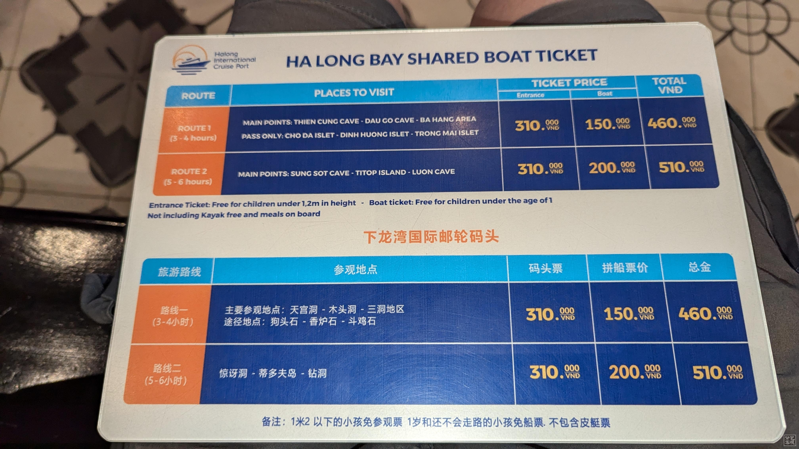
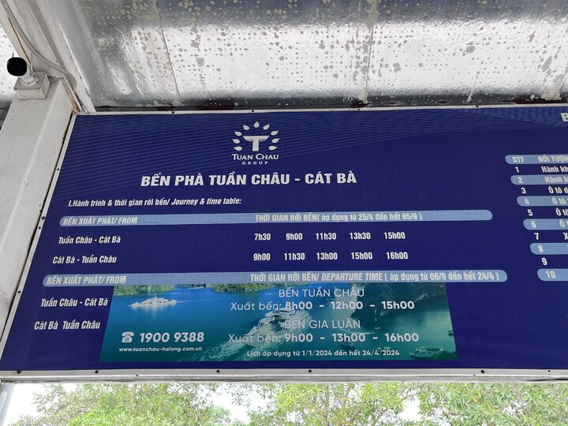

[Read in English](./README.en.md)

# 🇻🇳 Vietnam · 2025/08

## 📍 概览

- **签证**  
  - 直接在官方网站申请电子签证即可，一般 3 个工作日办好。  
  - 无需购买昂贵的加急服务。  
  - 中国公民：入境时需将电子签证换成单独的纸签证（出入境章盖在纸签证上而不是护照上，以规避新版护照上的“九段线”问题）。  
  - 其他国家公民：电子签证可直接入境。  

- **气候与健康**  
  - 越南潮湿闷热，注意防暑降温，多喝水。  
  - 公共饮水机极少（在胡志明墓旁见到过一个）。  
  - 即使煮沸，自来水也不建议饮用。推荐在超市购买大桶（约 1 加仑）的瓶装水。  
  - 河内、下龙湾治安较好；胡志明市、芽庄游客集中，要注意飞车党（手机挂脖、背包前置）。  

- **城市物价**  
  - 胡志明市（最大城市）物价 ≈ 河内 +25%， ≈ 岘港 ×2。  
  - 推荐行程：胡志明市 → 岘港 → 河内 → 离开前在河内购物（纪念品相对便宜）。  

- **语言与交流**  
  - 当地人普遍友好，但大多数不会说英语。需依靠 Google Translate。  
  - 可学习一些简单越南语：  
    - **Xin chào**（新找）= 你好  
    - **Cám ơn**（感恩）= 谢谢  
    - **Bao nhiêu**（貓妞）= 多少钱  
    - **Bến xe buýt** = 公交站  
  - 然而即使问“多少钱”，对方回答多为越南语，常听不懂。  

- **物价与消费**  
  - 大部分小馆、市场无标价。游客价格通常较高。  
  - 建议选择有公示价格的餐馆/商店，或向正在消费的当地人询价。  
  - 2025 年越南居民月收入中位数约 **1490 万 VND**（≈ 573–600 USD），可参考消费水平判断价格是否合理。  

---

## 💰 换钱与支付

- **现金为主**：多数场合仅收现金。  
- **ATM**  
  - 河内机场：Agribank 可取款。  
  - 市区：HSBC 可取。  
  - 取款时请选择 **decline** ATM 提供的汇率。  
- **刷卡**  
  - 部分便利店（Circle K, WinMart）、快餐（如麦当劳）可刷卡。  

---

## 📱 手机 & 网络

- **Google Vietnam eSIM**，推荐直接购买，方便快捷。  

---

## 🚌 交通

- **城市公交**  
  - 河内、胡志明等大城市均有公交车。  
  - Google Maps 可查询车站及班次，准确度较高。  
  - 上车找座位/站稳后，会有人上前收钱并给票。  
  - 下车需根据 Google Maps 提示按铃。  

- **长途交通**  
  - 可在以下网站比价并订票：  
    - [12go](https://12go.asia/)  
    - [Vexere](https://vexere.com/)  
    - [Klook](https://www.klook.com/) / [KKday](https://www.kkday.com/)  

- **摩托车**  
  - 自行租骑可行，但需谨慎。  

- **网约车**  
  - 推荐 **Grab**（东南亚的 Uber）。  
  - 注意事项：  
    - 上车前确认车牌是否与订单一致。  
    - 若司机称“兄弟的车”且车牌不符，切勿上车。  
    - Grab 自动扣费，无需额外支付“机场费”。  

- **火车**  
  - 条件允许可尝试火车贯穿越南，沿途风景不错。  

---

## 🏨 住宿

- Airbnb / 酒店皆可。  
- 必选 **冷气房**，以免高温难耐。  
- 建议住在景点附近，减少长距离步行。  

---

## 🍜 饮食推荐

- **街头小吃**  
  - 味道地道，价格便宜，但卫生条件不一。  

- **经典菜肴**  
  - 炸春卷（Chả giò / Nem rán）  
  - 广南面（Mì Quảng）  
  - 越式法棍（Bánh mì）  
  - 河粉（Phở）  
  - 火锅（Lẩu）  
  - 粥（Cháo）  
  - 香菇肉丸米线（Bún mọc）  
  - 越南粉卷（Bánh cuốn）  
  - 粿（Bánh giò）  
  - 糯米饭（Xôi）  
  - 黑豆甜品（Chè Đậu Đen） 

- **旅游限定**  
  - **蛋咖啡（Egg Coffee）**：多见于景区，其他地方很少。  
  - **会安“三大名吃”**：多为游客体验，当地人少吃。  

---

## 🎁 纪念品 & 礼物

### 📌 购物建议
- 避免在热门景点购物，即使砍价也可能仍被高估。  
- 推荐购买地点：  
  - **Circle K / WinMart** 便利店  
  - **Aeon Mall** 大型超市  
  - 价格透明，品质有保障。  

### 🛍️ 推荐清单
1. **咖啡**  
   - MR. VIET 越南先生咖啡  
   - Legend Coffee  
   - ARCHCAFE 咖啡  
   - Con Soc 松鼠牌咖啡  

2. **干货 & 零食**  
   - 芒果干  
   - 带皮腰果  
   - 绿豆糕  

3. **特色用品**  
   - 越南滴漏咖啡壶  
   - 越南茶杯

# 🗼 河内

## 🛬 到达 & 交通
- **机场 → 市区**
  - **86 路机场快线**（从 T2 出发，直达老城区，方便快捷）。  
  - **17 路公车**（更便宜，但只到 T1，需要乘免费接驳车 T1 ↔ T2）。  

- **市内景点分布**  
  河内主要景点较集中，1–2 天可基本游览完毕。

---

## 📍 主要景点

1. **胡志明陵寝 & 胡志明博物馆 / 故居**  
   - 注意：**参观须知** → 不可穿短裤，不可携带瓶装水。  
   - 参观陵墓时需走 **西南角入口**，不要走正门广场两侧的两个检查口。  

2. **文庙（Temple of Literature）**  
   - 15 岁以下儿童免费。  
   - 建筑群有五个庭院，各具特色。  
   - 第二院落的凉亭图案印在 100,000 越南盾纸币上。  

3. **还剑湖（Hoàn Kiếm Lake）**  
   - 推荐周六、周日来访 → 全面交通管制，湖区只对行人开放。  
   - 传说黎利大王在湖中获得神龟赠剑，用以击退明朝军队并建立后黎朝；建国后又将宝剑归还神龟，由此得名“还剑湖”。  
   - 建议环湖一周，感受不同角度的越南风情。  

4. **三十六古街 & 同春市场（Old Quarter & Dong Xuan Market）**  
   - 购物、吃小吃、看街景的好去处。  
   - Ô Quan Chưởng 城门也是古街标志。  

5. **昇龙水上木偶剧院（Thang Long Water Puppet Theatre）**  
   - 门票紧俏，建议抵达河内当天订票，或提前线上预订。  
   - 水上木偶剧有千年历史，故事取材自民间传说与日常生活。  
   - 特点：木偶在水面上表演，配合灯光与水波，仿佛有生命。  
   - 小朋友们特别喜欢。  

6. **圣若瑟大教堂（河内大教堂）**  
   - 仿巴黎圣母院的哥特式建筑（法国殖民时期建造）。  
   - 外观虽不华丽，但庄严肃穆；内部彩色玻璃典雅华美。  

7. **镇国古寺（Trấn Quốc Pagoda） & 西湖**  
   - 越南最古老的寺庙（建于 6 世纪，17 世纪迁至西湖）。  
   - 许多人认为在此可净化心灵、感受平静。  
   - 前广场是欣赏西湖美景的最佳位置。  
   - 院内有来自印度总统赠送的菩提树。  

8. **火炉监狱（Hỏa Lò Prison）**  
   - 越战时期的重要遗址，展示历史背景。  

9. **昇龙皇城遗址（Imperial Citadel of Thăng Long）**  
   - 世界文化遗产，始建于李朝，后经多次扩建。  
   - 部分区域仍在修缮(2025.8)。  
   - 展厅内均有空调，如果时间有限可跳过。  

10. **关圣庙（Quan Thanh Temple）**  

11. **河内火车街（Train Street）**  
   - 火车每天数次经过居民楼前，极具特色。  

12. **Phùng Hưng 壁画街**  
   - 以壁画装饰拱门和街道，适合拍照。  

13. **河内大剧院（Hanoi Opera House）**  
   - 法式建筑风格，外观与内部都值得一看。  

# 🌊 下龙湾 (Hạ Long Bay)

## 📍 概览
- 1994 年被列入联合国世界自然遗产  
- 2011 年入选「新世界七大自然奇观」  
- 因景色酷似桂林山水，又称“海上桂林”  
- 越南必去景点之一  

---

## 🚍 交通方式

### 从河内前往下龙湾
- **跟团游**：可直接购买一日或多日游套票，包含大巴 + 游船。  
- **自行前往**：  
  1. 从三十六古街搭 **34 路公交** → 终点站下车。  
  2. 步行至 **Mỹ Đình 长途车站 (Quảng Trường Bến Xe Mỹ Đình)**。  
  3. 转乘前往 **Bãi Cháy 长途车站 (Bến xe Bãi Cháy)** 的巴士。  
  4. 抵达后打车 (~150,000 VND) 到下龙湾码头售票中心（蓝+卡其色交错建筑）。  

---

## 🛥️ 游船 & 行程

- **船票**：分为 **4 小时** & **6 小时**两种，推荐 6 小时。  
  - 主要景点：Sung Sot 洞、英雄岛、神秘洞、划竹筏/独木舟体验。  
- **发船时间**：  
  - 上午 9:00  
  - 中午 12:00  
- **建议**：前一晚先到下龙市 → 参加早上 9:00 的船 → 下午返程，可赶飞机或继续去吉婆岛。  
- 带上游泳衣

---

## 🍜 美食推荐
下龙湾不可错过的小吃：  
- 鸡粉  
- 虾饼  
- 肉粽  
- 灌肠  
- 炸春卷  
- 牛肉火锅  
- 绿豆糕  

📍 在下龙市白斋中心区西侧，有成排便宜餐馆可选择。  

---

## 🚌 回程 & 延伸路线

### 当日返回河内
- 若当晚需搭飞机，可选择 **河内一日团** → 回程在 **Aeon Mall** 下车 → 打 Grab 前往机场。  

### 前往海防 (Hải Phòng)
- 海防离下龙湾很近，可作为中转。  
- 从 **Bãi Cháy 车站** 购票 → 前往 **Hải Phòng Lê Chân 车站**。  
- 海防有直飞岘港、顺化等航班。  

---

## 🏝️ 吉婆岛 (Cát Bà Island) & Lan Ha Bay

### 从下龙湾到吉婆岛
- 在下龙湾码头购买 **Tuần Châu (Halong City) → Gia Luận (Cát Bà Island)** 船票。  
- 发船时间：07:30 / 09:00 / 11:30 / 13:30 / 15:00  
- 售票亭会询问是否购买吉婆岛 → Lan Ha Bay 的巴士或租摩托，可直接一起支付。  

### 吉婆岛玩法
- **Cat Ba National Park**：登山、徒步  
- **Trung Trang Cave**  
- **Minh Châu Cave**  

---

## 🚉 从海防到吉婆岛

- 过去有 **Hải Phòng → Cát Bà** 直达船 (Bến tàu Cát Bà)，2025.8 已停运。  
- 替代路线：  
  1. 从机场 → 打 Grab 或 Google Maps 到市区找公交 → 抵达 **16C 公交站**。  
  2. 搭车至 **Bến phà Gót 码头**。  
  3. 在此可选择：  
     - **缆车** → 推荐！查询 [Cat Ba Sunworld Cable Car 官网](https://catba.sunworld.vn/en/)  
     - **渡船**  
  4. 抵达 **Cát Bà 岛 Cái Viềng 码头 (Bến phà Cái Viềng)**。  
  5. 转乘 **14 路巴士 (13,000 VND)** → 吉婆岛市区。  

- **返程**：吉婆岛 → 海防 路线反向即可。  

# 🏮 会安 (Hội An)

## 📍 概览
- 位于越南中部广南省，距离岘港约 30 公里。  
- 16–17 世纪与马六甲并称东南亚最繁忙的贸易港口。  
- 历史与文化遗产丰富，融合了日本、中国、西班牙、荷兰等国的影响。  
- 标志性建筑：日本廊桥、华人会馆、黄墙老街。  
- 1999 年被联合国教科文组织列入 **世界文化遗产**。  

---

## 🚍 到达
- **公车**：岘港可乘 **LK02 公车** → 会安市区（可在 **Số 270 Trần Phú** 上车）。  
- **大巴**：购买巴士公司车票，直达会安。  

---

## 🌃 游玩建议
- **夜景**：会安夜景极具魅力，建议至少住一晚。8 点后才最热闹。  
- **古城门票**：进入古城免费，但进入内部景点需购买套票（可参观 5 个景点）。  
  - 推荐：**民俗文化博物馆 (Museum of Folk Culture)** → 可观看节目，馆内有空调。  
- **游玩时长**：古城不大，半天到一天足够。可以考虑和岘港五行山安排在一天，LK02公车也经过五行山。

---

## 🍜 美食
- **特色小吃**：  
  - Bánh Mì（会安法棍）  
  - 白玫瑰饺子 (Bông Hồng Trắng White Rose)  
  - 炸云吞  
  - Cao Lầu 高楼面  
  - Mì Quảng 广南面  
  - Cơm Gà 鸡饭  
- **实用提示**：  
  - 古城内餐馆多为游客定价。  
  - 想吃实惠正宗的 → 去 **会安市场熟食区**。  
  - 法棍口感香脆，但要加足酱汁，不然会偏干。  
  - 大多数摊贩无标价 → 记得和老板 **砍价**。  

---

## 🏛️ 主要景点

1. **日本廊桥 (Cầu Nhật Bản)**  
   - 会安地标建筑，连接古城两端。  
   - 印在 20,000 VND 越南盾纸币上 → 可用钞票合影。  
   - 桥头分别有猴与狗的雕像 → 传说因猴年动工，狗年完工。  

2. **黄墙老街 & 古宅**  
   - 漫步在黄色墙面的巷弄中，感受历史氛围。  
   - **黎氏宗祠 / Tan Ky Old House**：数百年历史，结合中式横梁、日式屋顶、越式窗格 → 独一无二。  

3. **福建会馆 (Assembly Hall of the Fujian Chinese Congregation)**  
   - 会安最大的华人会馆。  
   - 主祀妈祖，庇护航海渔民 → 早期华人信仰中心。  

4. **中华会馆 (Chinese All-Community Assembly)**  
   - 最早的华人会馆，相传建于明代。  
   - 曾是会安华人聚会与互助的基地。  

5. **贸易瓷器博物馆 (Museum of Trading Ceramics)**  
   - 展示古代贸易瓷器与文物。  
   - 两层建筑，保存了许多多国古物。  

6. **民俗文化博物馆 (Museum of Folk Culture)**  
   - 展出会安的民俗与传统表演。  
   - 馆内有空调，休息好去处。  

7. **会安夜市 (Hoi An Night Market)**  
   - 热门夜市，体验街头美食、选购手工纪念品。  
   - 灯笼点亮街道，氛围浪漫。  

8. **椰子船 (Basket Boat)**  
   - 会安周边的特色体验 → 圆形竹编船，在水椰林里划行。  

---

## 📝 小贴士
- 夜景是重点，一定要留宿一晚。  
- 食物、手工艺品在市场或夜市购买更划算。  
- 景点套票更省钱，推荐购买。  

# 🏯 顺化 (Huế)

## 📍 概览
- 距离岘港车程约 2 小时。  
- 拥有千年历史，曾是越南 **三朝古都**，也是阮朝所在地与越南旧都。  
- 代表景点：顺化皇城、启定陵、灵姥寺（天姥寺）、香江。  
- 承载政治、经济与文化精华，被誉为“风花雪月之都”。  
- **1993 年**入选联合国教科文组织 **世界文化遗产**。  

---

## 🚍 交通方式
- **岘港出发**  
  - 旅行团（一日游，可通过 Klook / KKday 预订）  
  - 共乘巴士（推荐，灵活不赶行程）  
  - 火车（岘港 – 顺化）  
- ⚠️ 一日团通常节奏较快，时间不足，建议选择共乘巴士。  

---

## 🏛️ 顺化皇城（Imperial City）
- 越南现存最庞大且保存最完整的古建筑群。  
- 建筑格局仿北京紫禁城，被称为 **“小紫禁城”**。  
- 外城：城墙长近 10 公里，高约 6 米，厚 20 米，共有 10 座城门。  
- 内城（皇城）：  
  - 四周护城河，城墙长约 2.5 公里。  
  - 午门（南门） → 地标建筑，也是保大帝退位之地。  
  - 太和殿（阮朝开国皇帝登基之所）：  
    - 前后两殿，黄色琉璃瓦，80 根朱红色立柱。  
    - 内饰金漆云龙浮雕，极尽庄严华丽。  
    - 是举行大朝仪、迎接使臣的主要场所。  
  - 太庙、世祖庙、长生宫、延寿宫、静明楼等 → 体现中越法混合建筑风格。  

---

## 🏯 紫禁城（Tử Cấm Thành）
- 建于 1804 年嘉隆帝时期，1822 年更名为紫禁城。  
- 位于皇城中央偏后方，是皇室居住与办公的区域。  
- 主要建筑：  
  - 干成殿（皇帝寝宫）  
  - 坤泰宫（后妃居所）  
  - 勤政殿（皇帝理政之所）  
  - 光明殿（太子寝宫）  
  - 顺辉院等妃嫔住所。  

---

## ⚰️ 启定陵（Tomb of Khải Định）
- 阮朝倒数第二位皇帝启定帝之陵墓（保大帝之父）。  
- 耗时 11 年建成，融合 **中式与法式建筑风格**，工艺极其精美。  
- 特点：  
  - 龙形雕刻阶梯，彰显帝王气势。  
  - 主殿启成殿内部 → 彩色琉璃瓦地板、龙纹壁画、花瓷碎片拼贴壁画。  
  - 气势辉煌，被誉为 **顺化三大皇陵中最美**。  
  - 平台石像（象、马、文武百官），因启定帝身高仅 150cm，所以等身石像皆矮小。  
- 寝殿中央安放启定帝铜像及陵寝（法国殖民背景下，葬礼公开举行）。  

---

## 🛕 灵姥寺（Chùa Thiên Mụ）
- 建于 16 世纪中叶，已有 400 多年历史。  
- 原名“天姥寺”，后因“天”字触讳，改名“灵姥寺”。  
- 位于香江河畔，是顺化最古老的佛寺。  
- 必看景点：  
  - **福缘塔**：七层八角形宝塔，高 21 米，建于绍治帝时期，已成顺化地标。  
  - **天蓝色汽车**：释广德和尚曾驾驶此车前往西贡自焚，以抗议政权迫害佛教，极具历史纪念意义。  

---

## 🌊 香江（Sông Hương）
- 绕顺化全长约 30 公里，被称为 **“顺化的灵魂”**。  
- 因上游遍布石菖蒲，水中常飘散幽香而得名。  
- 两岸风光秀美，适合泛舟或散步。  

# 🌊 岘港 (Đà Nẵng)

## 📍 概览
- 距离机场 → 市中心仅几公里，车程约 15 分钟。  
- 出行方式：出租车、Grab、机场班车都很方便。  
- 被誉为越南最安全的城市之一，街道干净整洁，当地人热情友好。  

---

## 🏔️ 巴拿山 (Bà Nà Hills)
- **门票**：可网上购票，QR code 入场。  
- **交通**：  
  - 公交车 **03 路直达**，可在 *Cầu đi bộ Nguyễn Tri Phương* 上车。可搭 Grab 或 12/14/16 路公交车前往*Cầu đi bộ Nguyễn Tri Phương*。
  - 末班车 19:00，推荐坐公交，下山时间灵活，避免旅行团人潮。通常下午 5 点后佛手金桥就几乎无人，是拍照最佳时段。  
- **游玩建议**：  
  - 早上先拍 **佛手金桥 (Golden Bridge)**，避开人群。  
  - 提前向工作人员确认缆车线路。  
  - 园区分为上/中/下三层：法国村、过山车、月亮城堡、奇幻乐园。  
  - 下雨天推荐去室内 **奇幻乐园 (Fantasy Park)**。  
- **特色**：  
  - 世界最长单线缆车 & 世界最高缆车。  
  - 一天之内可体验四季气候变化。  
- **亮点**：  
  - **佛手金桥**：2018 年启用，由巨手托起的空中步道，常被云雾笼罩。  
  - **灵应寺**：27 米高释迦牟尼佛像，气势恢宏。  
  - **法国村**：欧式建筑 & 表演，适合拍照。  
  - **永久广场 (Forever Square)**：集合点，巨型向日葵地标 & 小型表演。  
  - **仿圣丹尼斯教堂**、**泡泡玛特古堡旗舰店**。  
  - **太阳神瀑布**：希腊罗马雕像区。  
  - **阿特拉斯雕像**、**日蚀广场**等主题景观。  
  - **游乐设施**：高山过山车、空中飞椅、旋转木马。  
  - **奇幻乐园 (Fantasy Park)**：越南最大室内乐园，大多数项目免费（碰碰车、射击、VR、4D/5D 影院等）。  
  - **月亮城堡 (Lunar Castle)**：中央巨型月球，设有 4D/5D 影院。  

---

## 🏛️ 美山圣地 (Mỹ Sơn Sanctuary)
- 联合国世界遗产，位于岘港西南 70 公里，车程约 1 小时。  
- 曾是 **占婆王国宗教与文化中心**，以印度教建筑风格为主，被称为“越南小吴哥”。  
- 特点：古老砖石塔楼、精美雕刻、占婆舞蹈表演。  
- 夏季酷热 → 注意防晒与补水。  
- 交通：可选择半日团 / 共乘巴士 / Grab。  

---

## 🏺 占族雕刻博物馆 (Cham Museum)
- 世界上收藏 **占族艺术品最丰富**的博物馆。  
- 建于 1915 年，由法国学者创办。  
- 馆藏：7–15 世纪占婆雕刻作品。  
- 强烈推荐 → 特别适合在参观过美山圣地后前往。  
- 雨天游览的好选择。  

---

## 🌉 龙桥 (Dragon Bridge)
- 岘港地标，全长 666 米，横跨韩江。  
- 夜晚有彩灯秀，周末/节假日 **21:00 有喷火喷水表演**，约 10 分钟。  
- 桥上设有步行道，可近距离观赏并拍照。  

---

## 🏖️ 美溪海滩 (Mỹ Khê Beach)
- 福布斯评为世界六大最美海滩之一。  
- 绵延 30 公里，白沙滩、清澈海水、椰林成荫。  
- 适合：冲浪、帆板、潜水、日落观赏。  
- 周边有餐厅与度假村，适合度假休闲。  

---

## 🪨 五行山 (Marble Mountains)
- 由五座石灰岩山丘组成：金、木、水、火、土。  
- 山上有洞穴、寺庙、佛像与雕刻，登顶可俯瞰岘港市与南中国海。  
- **玉山寺 (Non Nước Pagoda)**：位于水山，内有古佛像与精美雕刻。  
- 交通：搭 **LK02 公车** → 游览后可去附近 **Non Nước 沙滩** 游泳（人少，步行 10 分钟）。  

---

## ⛪ 岘港大教堂 (Da Nang Cathedral)
- 建于 1923 年法国殖民时期。  
- 粉色外观非常显眼，因屋顶风信鸡又称 **“鸡教堂”**。  

---

## 🛍️ 韩江夜市 (Han Market)
- 岘港市中心夜市，氛围热闹。  
- 售卖水果、海鲜、手工艺品、服饰等。  
- 可品尝越南特色小吃（河粉、春卷、炸鱼饼）。  
- ⚠️ 建议砍价，从标价的 **20% 开始**。  
- 不太推荐在此购物，价格与质量不如便利店和商场，但值得体验氛围。  

# 🌆 胡志明市 (Ho Chi Minh City / Sài Gòn)

## 📍 概览
- 越南的经济、文化、旅游与教育中心。  
- 保留殖民时期的法式建筑与独特的越南风情。  
- 美食、夜生活丰富，但与岘港相比，当地人对游客的友善度稍差。  
- 出行提示：  
  - 从机场到市区：Grab、公车皆可。  
  - ⚠️ 注意交通拥堵，赶飞机需留足时间。  
- 景点集中，市中心可步行游览。  

---

## 🏛️ 历史与地标建筑
- **统一宫（独立宫）**  
  - 曾为总统府，是越战结束的象征。  
  - 北越坦克冲破大门，标志战争终结。  
  - 内部可参观宴会厅、会议室、总统办公室等。  

- **胡志明市政厅（人民委员会大楼）**  
  - 门前有胡志明雕像。  
  - 建筑外观精致，夜晚灯光更显壮丽。  
  - ⚠️ 内部不开放，仅可外部参观。  

- **西贡圣母大教堂（红教堂）**  
  - 法式哥特式建筑，彩色玻璃与拱顶壮观。  
  - 城市地标，适合拍照打卡。

- **西贡中央邮局**  
  - 紧邻红教堂。  
  - 法式风格建筑，内部如同火车站大厅，设有木制电话亭。  
  - 可购买明信片并寄回家。  

- **胡志明市书街**  
  - 紧邻红教堂与邮局。  
  - 两侧布满书店与咖啡馆，常举办签书会与文化活动。  
  - 文青氛围浓厚。  

- **西贡歌剧院**  
  - 法式殖民建筑，仍在使用。  
  - 推荐观看 **AO Show（竹艺马戏表演）**，结合舞蹈、音乐与杂技，展现越南文化。  

- **粉红教堂（耶稣圣心堂）**  
  - 因粉色外墙被称为“粉红教堂”。  
  - 少女风的打卡圣地，极具梦幻感。

---

## 🏺 博物馆与历史遗迹
- **战争遗迹博物馆**  
  - 展示战争相关文物：照片、武器、酷刑工具等。  
  - 户外展区有战机、炮弹等大型展品。  
  - 直观感受战争的残酷与历史记忆。  

- **金龙水上木偶剧院**  
  - 越南国宝级表演艺术。  
  - 木偶由演员在水中操控，配合民族音乐，场面生动有趣。  
  - 若在河内错过，可在胡志明市补看。  

---

## 🕌 宗教与文化
- **永严寺**  
  - 七层佛寺，融合越式传统与日式风格。  
  - 北方移民佛教徒所建，作为精神寄托。  
  - 在盂兰盆节期间参观可参与祈福仪式。  

- **中央清真寺 (Jamia Al-Musulman Mosque)**  
  - 建于 1975 年，绿色外墙醒目。  
  - 内部大理石柱、金色马赛克装饰，夜晚灯光下格外美丽。 
---

## 🌉 广场与街道
- **阮惠街广场**  
  - 市中心地标，两侧林立高楼与五星级酒店。  
  - 周边景点：歌剧院、市政厅、咖啡公寓。  
  - 夜间灯光璀璨，常有街头艺人表演。  

- **咖啡公寓**  
  - 老旧大楼改造，入驻多家咖啡馆。  
  - 外观如“格子盒子”，每家店风格不同。  
  - 必打卡文青景点，可尝试 **Egg Coffee**。  

- **范五老街 (Phạm Ngũ Lão Street)**  
  - 夜生活中心，背包客聚集区。  
  - 酒吧、夜店、咖啡馆、餐馆林立。  
  - 晚上热闹非凡，有街头表演。  

---

## 🌊 西贡河
- 胡志明市重要河流。  
- 白天可乘船游览，体验 SUP；晚上可参加游船晚宴。  
- 夜景不如岘港，但仍值得体验。  

---

## 🛍️ 市集与购物
- **滨城市场 (Ben Thanh Market)**  
  - 拥有 1600 多个摊位，售卖干货、零食、服饰、纪念品等。  
  - ⚠️ 价格虚高，不推荐购物。  

- **Vincom Center & WinMart**  
  - 推荐购买纪念品：咖啡、绿豆糕、越式咖啡滴漏壶等。  
  - 地址：Lê Thánh Tôn/72 Đồng Khởi, Quận 1。坐直梯到B3。

---

## 🌴 周边游
- **湄公河三角洲一日游**  
  - 世界第十二长河流经多国，在越南下游形成三角洲。  
  - 活动：椰子糖工坊、果园、养蜂场、乘船游览。  

- **古芝地道 (Củ Chi Tunnels)**  
  - 越战时期的地下军事工事。  
  - 曾用作藏身、储武与生活区。  
  - 可亲身体验当年战时生活环境。  

