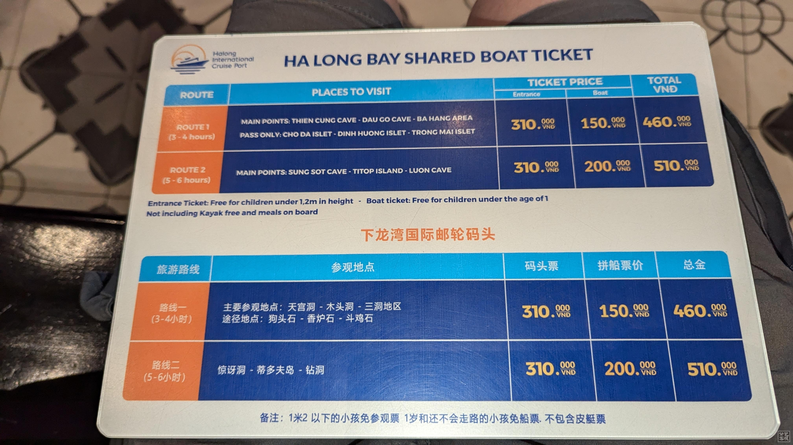

[阅读中文版](./README.cn.md)

# 🇻🇳 Vietnam · 2025/08

## 📍 Overview

- **Visa**  
  - Apply directly through the official e-visa website (processing takes ~3 business days).  
  - No need for overpriced "express" services.  
  - **Chinese citizens**: e-visa must be exchanged for a separate paper visa upon entry (immigration stamps are placed on the paper visa, not the passport, to avoid issues with the “nine-dash line” map in newer passports).  
  - **Other nationalities**: may enter directly with e-visa.  

- **Climate & Health**  
  - Hot and humid—stay hydrated and avoid heatstroke.  
  - Public drinking fountains are rare (only spotted one near Ho Chi Minh Mausoleum).  
  - Tap water, even boiled, is not recommended—buy large bottled water (1 gallon) from supermarkets.  
  - Hanoi & Ha Long Bay: generally safe.  
  - Ho Chi Minh City & Nha Trang: crowded with tourists—beware of **bag snatchers / motorbike thieves** (wear phone lanyard, keep backpack in front).  

- **Prices & Cities**  
  - Ho Chi Minh City (largest) ≈ +25% vs. Hanoi; ≈ 2× Da Nang.  
  - Suggested route: **Ho Chi Minh → Da Nang → Hanoi**, then shop before departure (souvenirs cheaper in Hanoi).  

- **Language & Communication**  
  - Locals are friendly but most don’t speak English. Use **Google Translate**.  
  - Learn some basics:  
    - **Xin chào** = Hello  
    - **Cám ơn** = Thank you  
    - **Bao nhiêu** = How much?  
    - **Bến xe buýt** = Bus stop  
  - Still, even if you ask “How much?”, replies are usually in Vietnamese and hard to understand.  

- **Spending & Local Economy**  
  - Most local eateries/markets have no posted prices; foreigners often pay more.  
  - Choose shops/restaurants with displayed prices, or ask locals nearby.  
  - Median monthly income in 2025: **14.9M VND** (~$573–600 USD)—use as a reference for fair pricing.  

---

## 💰 Money & Payments
- Cash is dominant.  
- **ATMs**: Agribank (airport), HSBC (city). Always **decline ATM’s exchange rate**.  
- **Cards**: accepted at Circle K, WinMart, McDonald’s, etc.  

---

## 📱 Mobile & Internet
- **Google Vietnam eSIM** eSIM is convenient and cheap.  

---

## 🚌 Transportation
- **City Buses**: routes on Google Maps (fairly accurate in Hanoi/Ho Chi Minh).  
  - Board, find seat/stand, conductor comes to collect fare & issue ticket.  
  - Press the stop button to get off.  
- **Long-distance**: compare/book via [12go](https://12go.asia/), [Vexere](https://vexere.com/), [Klook](https://www.klook.com/), [KKday](https://www.kkday.com/).  
- **Motorbike**: renting possible, but risky.  
- **Grab (ride-hailing)**: safer than taxis.  
  - Verify license plate matches the app.  
  - Ignore claims like “brother’s car” if plate doesn’t match.  
  - No need to pay “airport fee”—Grab auto-charges.  
- **Trains**: possible to ride across Vietnam with scenic views.  

---

## 🏨 Accommodation
- Airbnb and hotels both fine—must have **air conditioning**.  
- Stay near attractions to avoid long hot walks.  

---

## 🍜 Food
- Street food is delicious but hygiene varies.  
- **Must-try dishes**:  
  - Spring rolls (Chả giò / Nem rán)  
  - Mì Quảng (Quang-style noodles)  
  - Bánh mì (Vietnamese baguette)  
  - Phở (rice noodle soup)  
  - Lẩu (hot pot)  
  - Cháo (porridge)  
  - Bún mọc (mushroom pork ball noodles)  
  - Bánh cuốn (steamed rice rolls)  
  - Bánh giò (sticky rice dumpling)  
  - Xôi (sticky rice)  
  - Chè Đậu Đen (Black Bean Sweet Dessert)
- **Tourist foods**:  
  - Egg coffee (mostly in tourist spots).  
  - Hoi An “Three Famous Dishes”—mainly for tourists, not locals.  

---

## 🎁 Souvenirs & Gifts

### 📌 Shopping Tips
- Avoid buying at tourist-heavy spots—even after bargaining, prices are often inflated.  
- Recommended places to shop:  
  - **Circle K / WinMart** convenience stores  
  - **Aeon Mall** supermarkets  
  - Transparent pricing and reliable quality.  

### 🛍️ Suggested Items
1. **Coffee**  
   - MR. VIET Coffee  
   - Legend Coffee  
   - ARCHCAFE Coffee  
   - Con Soc “Squirrel” Brand Coffee  

2. **Snacks & Dried Goods**  
   - Dried mango  
   - Cashews (with skin)  
   - Mung bean cakes  

3. **Special Items**  
   - Vietnamese drip coffee filter  
   - Vietnamese teacups   

# Hanoi

## 🛬 Arrival & Transport
- **Airport → Old Quarter**
  - **Bus 86 (Express)**: from Terminal 2 (T2) direct to Old Quarter.  
  - **Bus 17**: cheaper, but only goes to T1; need to take the free T1–T2 shuttle.  

- **City Layout**  
  Most attractions are concentrated in central Hanoi and can be visited within 1–2 days.  

---

## 📍 Major Attractions

1. **Ho Chi Minh Mausoleum & Museum / Residence**  
   - **Rules**: no shorts, no bottled water.  
   - Use the **southwest entrance**; avoid the two checkpoints facing the square.  

2. **Temple of Literature (Văn Miếu)**  
   - Free for children under 15.  
   - Features five courtyards, each with unique architecture.  
   - The pavilion in the second courtyard appears on the 100,000 VND banknote.  

3. **Hoàn Kiếm Lake (Lake of the Returned Sword)**  
   - Best visited on weekends when the area is pedestrian-only.  
   - Legend: King Lê Lợi received a magic sword from a turtle here, defeated the Ming army, and later returned the sword—hence the name.  
   - Recommended to walk a full circle around the lake.  

4. **Old Quarter & Dong Xuan Market**  
   - Famous for street food, shopping, and historic atmosphere.  
   - Ô Quan Chưởng Gate is a landmark.  

5. **Thang Long Water Puppet Theatre**  
   - Tickets sell out quickly—book online or on your first day.  
   - Performance tradition dates back ~1000 years, based on folk tales and rural life.  
   - Puppets move on water, enhanced by lights and ripples, creating lifelike effects.  

6. **St. Joseph’s Cathedral (Hanoi Cathedral)**  
   - Gothic style, modeled after Notre Dame de Paris.  
   - Exterior is solemn; interior has beautiful stained glass.  

7. **Trấn Quốc Pagoda & West Lake**  
   - Oldest pagoda in Vietnam (6th century, relocated in 17th century).  
   - Considered a place of spiritual peace.  
   - Great viewpoint for West Lake.  
   - Houses a Bodhi tree gifted by an Indian president.  

8. **Hỏa Lò Prison (Hanoi Hilton)**  
   - Historical site from the French colonial era & Vietnam War.  

9. **Imperial Citadel of Thăng Long**  
   - UNESCO World Heritage Site, built during the Lý dynasty.  
   - Some areas under renovation in Aug 2025.  
   - Exhibition halls have air conditioning; optional if short on time.  

10. **Quan Thanh Temple**  

11. **Hanoi Train Street**  
   - Trains run several times daily through narrow residential streets.  

12. **Phùng Hưng Mural Street**  
   - Archways decorated with murals, popular photo spot.  

13. **Hanoi Opera House**  
   - French colonial architecture, impressive both inside and out.  

# 🌊 Hạ Long Bay

## 📍 Overview
- UNESCO World Heritage Site (1994)  
- Named one of the New 7 Natural Wonders (2011)  
- Nicknamed “Guilin on the Sea” for its karst scenery  
- A must-visit destination in Vietnam  

---

## 🚍 Getting There

### From Hanoi to Hạ Long Bay
- **Tour package**: One-day or multi-day tours (bus + cruise).  
- **DIY route**:  
  1. Take **Bus 34** from the Old Quarter → final stop.  
  2. Walk to **Mỹ Đình Bus Station (Quảng Trường Bến Xe Mỹ Đình)**.  
  3. Catch a bus to **Bãi Cháy Bus Station (Bến xe Bãi Cháy)**.  
  4. Taxi (~150,000 VND) to the pier ticket office (blue + khaki building).  

---

## 🛥️ Cruises & Itinerary
- **Tickets**: 4-hour or 6-hour (recommend 6 hours).  
  - Sights: Sung Sot Cave, Titov Island, Mystery Cave, bamboo boat/kayak ride.  
- **Departure times**: 09:00 / 12:00.  
- **Tip**: Stay in Hạ Long the night before → take 9:00 cruise → return early for flight or head to Cát Bà.  
- Bring your swimsuit.

---

## 🍜 Food
Local specialties: chicken noodles, shrimp cakes, sticky rice dumplings, sausages, spring rolls, beef hotpot, mung bean cakes.  
📍 Cheap eateries line the west side of Bãi Cháy town center.  

---

## 🚌 Return & Extensions
- **Back to Hanoi**: For same-day flights, book a Hanoi day tour → get dropped at **Aeon Mall** → Grab to airport.  
- **To Hải Phòng**:  
  - From **Bãi Cháy Bus Station** → buy ticket to **Hải Phòng Lê Chân Station**.  
  - Hải Phòng offers direct flights to Da Nang, Huế.  

---

## 🏝️ Cát Bà Island & Lan Ha Bay
- From Hạ Long pier, buy ticket: **Tuần Châu → Gia Luận (Cát Bà)**.  
- Departures: 07:30 / 09:00 / 11:30 / 13:30 / 15:00.  
- At ticket booth, you may be offered add-ons (bus to Lan Ha Bay or motorbike rental).  

**Things to do on Cát Bà**  
- Cat Ba National Park (hiking)  
- Trung Trang Cave, Minh Châu Cave  

---

## 🚉 From Hải Phòng to Cát Bà
- Direct ferries (Bến tàu Cát Bà) no longer running (2025.8).  
- Alternative:  
  1. From airport → Grab/bus → Bus stop 16C.  
  2. Continue to **Bến phà Gót Pier**.  
  3. Options:  
     - **Cable car** (recommended! [Cat Ba Cable Car](https://catba.sunworld.vn/en/))  
     - Ferry  
  4. Arrive at **Cái Viềng Pier (Bến phà Cái Viềng)**.  
  5. Take **Bus 14 (13,000 VND)** to Cát Bà Town.  
- Return: reverse the route. 

# 🏮 Hội An

## 📍 Overview
- Located in Quảng Nam Province, Central Vietnam (~30 km from Da Nang).  
- In the 16–17th centuries, one of Southeast Asia’s busiest trading ports (alongside Malacca).  
- Cultural blend of Japanese, Chinese, Spanish, Dutch influences.  
- Iconic landmarks: Japanese Covered Bridge, Chinese Assembly Halls, yellow old town streets.  
- Listed as a **UNESCO World Heritage Site** in 1999.  

---

## 🚍 Getting There
- **Bus**: From Da Nang, take **Bus LK02** → Hội An center (boarding at **Số 270 Trần Phú**).  
- **Coach**: Buy intercity bus tickets direct to Hội An.  

---

## 🌃 Tips for Visiting
- **Night Scene**: Best visited in the evening—most lively after 8 PM. Staying overnight is recommended.  
- **Tickets**: Entry to the Old Town is free, but heritage sites require a **combo ticket** (valid for 5 sites).  
  - Recommended: **Museum of Folk Culture** (shows + air conditioning).  
- **Duration**: Half a day to one full day is sufficient. You can also combine it with a visit to Marble Mountains (Ngũ Hành Sơn) in Da Nang, which Bus LK02 passes by.

---

## 🍜 Food
- **Local Specialties**:  
  - Bánh Mì (sandwich)  
  - White Rose Dumplings (Bông Hồng Trắng)  
  - Fried wontons  
  - Cao Lầu noodles  
  - Mì Quảng (Quang noodles)  
  - Cơm Gà (chicken rice)  
- **Tips**:  
  - Most eateries in Old Town cater to tourists (higher prices).  
  - For affordable authentic food → try the **Hội An Market food court**.  
  - Bánh Mì is crispy but dry—needs extra sauce.  
  - Many stalls don’t display prices → be ready to **bargain**.  

---

## 🏛️ Main Attractions

1. **Japanese Covered Bridge (Cầu Nhật Bản)**  
   - Hội An’s most famous landmark, appears on the 20,000 VND note.  
   - Features monkey and dog statues → built starting in the Year of the Monkey, finished in the Year of the Dog.  

2. **Yellow Streets & Old Houses**  
   - Stroll through narrow alleys with yellow walls.  
   - **Tan Ky Old House**: unique mix of Chinese beams, Japanese roof, Vietnamese windows.  

3. **Fujian Assembly Hall**  
   - Largest Chinese congregation hall in Hội An.  
   - Dedicated to Mazu, protector of sailors.  

4. **Chinese All-Community Assembly Hall**  
   - Oldest Chinese hall in Hội An, said to date back to the Ming dynasty.  

5. **Museum of Trading Ceramics**  
   - Two-story museum of ancient ceramics and artifacts from Hội An’s trading era.  

6. **Museum of Folk Culture**  
   - Exhibits folk traditions & performances, air-conditioned.  

7. **Hội An Night Market**  
   - Street food, handicrafts, and glowing lantern streets.  

8. **Basket Boat Ride**  
   - Unique circular bamboo boats through nipa palm forests.  

---

## 📝 Travel Notes
- Stay overnight to enjoy the full night atmosphere.  
- Food and souvenirs are cheaper in markets and night bazaars.  
- Combo ticket is the best value for visiting heritage sites. 

# 🏯 Huế

## 📍 Overview
- ~2 hours by car from Da Nang.  
- Ancient capital of Vietnam for several dynasties; seat of the Nguyễn emperors.  
- Key sites: Imperial City, Forbidden Purple City, Tomb of Khải Định, Thiên Mụ Pagoda, Perfume River.  
- Known as the cultural and historical heart of Vietnam, “city of poetry and romance.”  
- UNESCO World Heritage Site since **1993**.  

---

## 🚍 Transportation
- **From Da Nang**:  
  - Day tours (Klook / KKday)  
  - Shared shuttle bus (recommended, slower pace)  
  - Train (Da Nang – Huế)  
- ⚠️ Day tours are rushed, less time to explore; shuttle bus is better.  

---

## 🏛️ Imperial City (Citadel)
- Largest and best-preserved ancient architectural complex in Vietnam.  
- Modeled after Beijing’s Forbidden City → nicknamed **“Little Forbidden City.”**  
- **Outer Citadel**: ~10 km walls, 6 m high, 20 m thick, 10 brick gates.  
- **Inner Citadel (Imperial City proper)**:  
  - Surrounded by moat and 2.5 km walls.  
  - Noon Gate (south): landmark & site of Emperor Bảo Đại’s abdication.  
  - Thái Hòa Palace:  
    - Coronation site of the first Nguyễn emperor.  
    - Venue for grand ceremonies and foreign envoys.  
    - Yellow glazed tiles, 80 red pillars, dragon reliefs.  
  - Nearby: Thế Miếu, Triệu Tổ Miếu, Trường Sinh Palace, Diên Thọ Palace, Tĩnh Minh Lâu (French influence).  

---

## 🏯 Forbidden Purple City (Tử Cấm Thành)
- Built 1804 (Gia Long), renamed 1822 (Minh Mạng).  
- Royal residence and administrative hub.  
- Key halls:  
  - Càn Thành Palace (Emperor’s quarters)  
  - Khôn Thái Palace (consorts)  
  - Cần Chánh Palace (working hall)  
  - Quang Minh Palace (Crown Prince)  
  - Residences for concubines (Thuận Huy Viện).  

---

## ⚰️ Tomb of Khải Định
- Tomb of Khải Định (r. 1916–1925), father of Bảo Đại (last emperor).  
- Took 11 years to complete; blends **Vietnamese, Chinese, and French** styles.  
- Highlights:  
  - Dragon-carved staircases.  
  - Thien Dinh Palace interior: colorful glass mosaics, dragon murals, tiled floors.  
  - Considered the **most beautiful of Huế’s imperial tombs**.  
  - Stone statues (elephants, horses, mandarins) made shorter as Khải Định himself was only 150 cm tall.  
- Bronze statue of the emperor sits above the burial site — unusual for Vietnam, reflecting French colonial influence.  

---

## 🛕 Thiên Mụ Pagoda
- Built mid-16th century, over 400 years old.  
- Originally “Chùa Thiên Mụ” (Pagoda of the Celestial Lady), later renamed.  
- Oldest pagoda in Huế, located along the Perfume River.  
- Must-see:  
  - **Phước Duyên Tower**: seven-story octagonal pagoda (21 m), built for the queen mother’s 80th birthday.  
  - **Blue Austin car**: vehicle driven by monk Thích Quảng Đức before his self-immolation in Saigon (1963).  

---

## 🌊 Perfume River (Sông Hương)
- Flows ~30 km through Huế, considered the **“soul of the city.”**  
- Named for the aromatic shrubs upriver that perfume its waters.  
- Ideal for boat rides and riverside walks.  

# 🌊 Đà Nẵng

## 📍 Overview
- Only a few kilometers from the airport to downtown (~15 minutes by car).  
- Transport: taxi, Grab, airport shuttle.  
- Considered one of the safest cities in Vietnam, with clean streets and friendly locals.  

---

## 🏔️ Bà Nà Hills
- **Tickets**: Buy online, QR code entry.  
- **Transport**:  
  - Bus **03** direct to Bà Nà Hills (stop: *Cầu đi bộ Nguyễn Tri Phương* Grab or buses 12/14/16 to *Cầu đi bộ Nguyễn Tri Phương*). 
  - Last bus: 19:00. Taking the bus allows more flexible return; by 5 PM most tour groups have left, so the Golden Bridge is much less crowded.  
- **Tips**:  
  - Visit the **Golden Bridge** in the morning for clear skies and fewer people.  
  - Ask staff for the correct cable car line.  
  - Park divided into upper / middle / lower zones: French Village, Alpine Coaster, Lunar Castle, Fantasy Park.  
  - On rainy days, head to indoor **Fantasy Park**.  
- **Highlights**:  
  - World’s longest single-cable gondola & highest cable car.  
  - Experience four seasons in one day as altitude rises.  
  - **Golden Bridge** (2018): iconic giant-hand walkway, often misty and atmospheric.  
  - **Linh Ứng Pagoda**: 27m Buddha statue.  
  - **French Village**: European-style streets & performances.  
  - **Forever Square**: landmark with giant sunflower, meeting point, small shows.  
  - **Replica of Saint-Denis Cathedral**, **Pop Mart flagship store**.  
  - **Helios Waterfall**: Greco-Roman statues.  
  - **Atlas Statue**, **Eclipse Plaza**.  
  - **Amusements**: Alpine Coaster, swing ride, carousel.  
  - **Fantasy Park**: Vietnam’s largest indoor amusement park, most rides free (VR, bumper cars, 4D/5D cinema, shooting games, etc.).  
  - **Lunar Castle**: giant moon centerpiece, new 4D/5D theaters.  

---

## 🏛️ Mỹ Sơn Sanctuary
- UNESCO World Heritage site, ~70 km southwest of Đà Nẵng (~1 hour by car).  
- Former **Cham Kingdom religious & cultural center** (Hindu temples).  
- Nicknamed “Vietnam’s Angkor.”  
- Features: red-brick towers, intricate carvings, Cham dance shows.  
- Very hot in summer → bring water & sun protection.  
- Transport: half-day tour / shared shuttle / Grab.  

---

## 🏺 Cham Sculpture Museum
- World’s richest collection of Cham art.  
- Founded in 1915 by French scholars.  
- Exhibits from 7th–15th century Cham Kingdom.  
- Highly recommended, especially after visiting Mỹ Sơn.  
- Great rainy-day option.  

---

## 🌉 Dragon Bridge
- Landmark bridge across the Han River, 666m long.  
- Nightly light shows; weekends/holidays **21:00 fire & water show** (10 mins).  
- Pedestrian paths allow close-up viewing & photos.  

---

## 🏖️ Mỹ Khê Beach
- Ranked by Forbes as one of the world’s six most beautiful beaches.  
- 30 km white-sand beach, clear water, lined with palms.  
- Activities: surfing, windsurfing, diving, sunset watching.  
- Surrounded by resorts & restaurants, perfect for relaxation.  

---

## 🪨 Marble Mountains
- Five limestone hills named after the five elements: Metal, Wood, Water, Fire, Earth.  
- Filled with caves, pagodas, Buddha statues, carvings.  
- Summit offers panoramic views of Đà Nẵng and the South China Sea.  
- **Non Nước Pagoda**: historic temple on Water Mountain.  
- Transport: Bus **LK02**; after visiting, walk 10 mins to **Non Nước Beach** (quiet, uncrowded).  

---

## ⛪ Da Nang Cathedral
- Built in 1923 during French colonial period.  
- Distinct pink exterior → nicknamed **“Rooster Church”** (weathercock on spire).  

---

## 🛍️ Han Market
- Central Đà Nẵng night market, lively atmosphere.  
- Sells fruits, seafood, handicrafts, clothes.  
- Local street food stalls: phở, spring rolls, fried fish cakes.  
- ⚠️ Start bargaining at ~20% of asking price.  
- Not the best for quality shopping—better at supermarkets—but fun to experience.  

# 🌆 Ho Chi Minh City (Sài Gòn)

## 📍 Overview
- Vietnam’s center of economy, culture, tourism, and education.  
- Mix of French colonial architecture and Vietnamese heritage.  
- Bustling nightlife and food culture, though locals may feel less friendly compared to Đà Nẵng.  
- Travel tips:  
  - From airport to downtown: Grab or bus.  
  - ⚠️ Heavy traffic—allow extra time for flights.  
- Most attractions are walkable within downtown.  

---

## 🏛️ Landmarks & Architecture
- **Independence Palace (Reunification Palace)**  
  - Former Presidential Palace, symbol of Vietnam War’s end.  
  - Explore banquet halls, meeting rooms, and offices.  

- **City Hall (People’s Committee Building)**  
  - Statue of Hồ Chí Minh in front.  
  - Not open inside, but exterior is stunning, especially at night.  

- **Saigon Notre-Dame Cathedral (Red Cathedral)**  
  - Neo-Gothic French architecture, stained-glass windows.  

- **Pink Church (Tan Dinh Church)**  
  - Bright pink façade, dreamy photo spot.  

- **Central Post Office**  
  - Beside Notre-Dame Cathedral, built in French style.  
  - Spacious interior with vintage phone booths; great for postcards.  

- **Book Street**  
  - Pedestrian street lined with bookstores & cafés, frequent cultural events.  

- **Saigon Opera House**  
  - French colonial building, still active.  
  - Don’t miss the **AO Show** (bamboo circus performance).  

---

## 🏺 Museums & Performances
- **War Remnants Museum**  
  - Powerful exhibits of war photos, weapons, torture devices.  
  - Outdoor display of planes, bombs, military equipment.  

- **Golden Dragon Water Puppet Theater**  
  - Traditional Vietnamese water puppetry, accompanied by live folk music.  

---

## 🛕 Temples & Religion
- **Vĩnh Nghiêm Pagoda**  
  - Seven-story pagoda, blending Vietnamese and Japanese styles.  
  - During Vu Lan Festival, visitors can join blessing rituals.  

- **Jamia Al-Musulman Mosque**  
  - Built 1975, green façade, marble pillars, gold mosaics.  

---

## 🌉 Squares & Streets
- **Nguyen Hue Walking Street**  
  - Wide pedestrian boulevard, lit up at night, lined with hotels and shops.  

- **Cafe Apartments**  
  - Old building converted into cafés, exterior looks like stacked boxes.  
  - Great for drinks, photos, and trying **Egg Coffee**.  

- **Pham Ngu Lao Street**  
  - Backpacker hub and nightlife center, with bars, restaurants, and street shows.  

---

## 🌊 Saigon River
- Daytime boat tours & SUP; evening dinner cruises available.  
- Night view less impressive than Đà Nẵng, but worth a try.  

---

## 🛍️ Markets & Shopping
- **Ben Thanh Market**  
  - 1,600+ stalls with food, clothes, souvenirs.  
  - ⚠️ Prices inflated, not ideal for shopping.  

- **Vincom Center & WinMart**  
  - Best place for souvenirs: coffee, mung bean cakes, drip filters.  
  - Address: Lê Thánh Tôn/72 Đồng Khởi, District 1. Take the lift and go to B3.

---

## 🌴 Day Trips
- **Mekong Delta**  
  - One-day trip to Vietnam’s fertile delta.  
  - Includes coconut candy workshop, orchards, bee farms, boat tours.  

- **Củ Chi Tunnels**  
  - Extensive underground tunnel network from wartime.  
  - Visitors can experience life during the conflict.  
